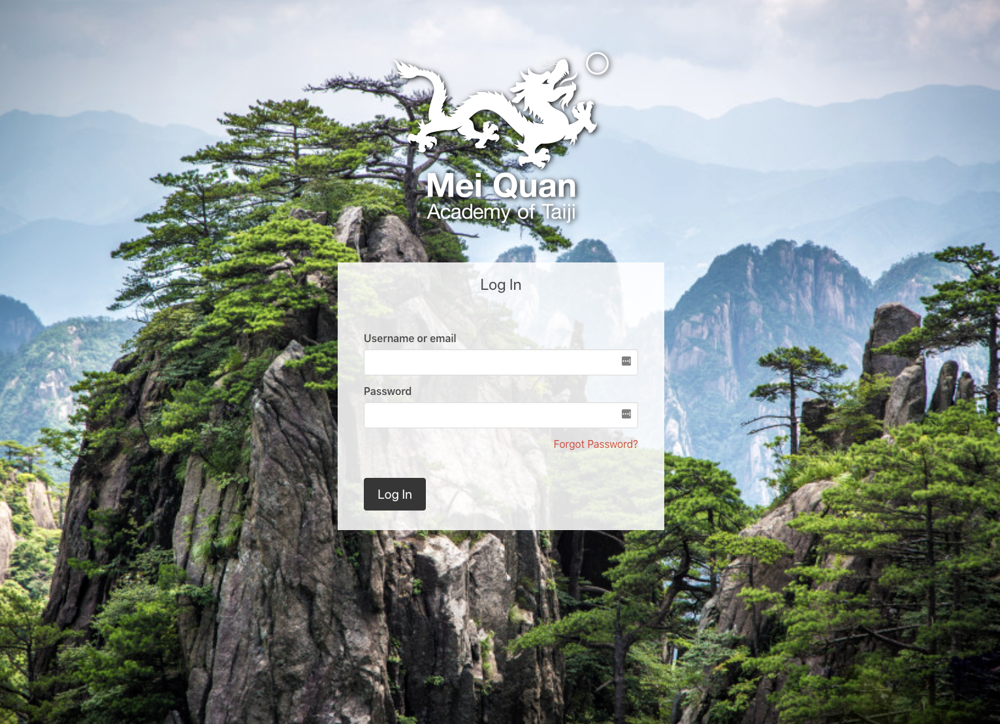

# Mei Quan Academy - Keycloak Login Theme

This repository contains a theme for Keycloak styled for the Mei Quan Academy Community Site.

Highlights:

- Provides a custom theme for:
  - login
  - account screen
- Uses `bulma` CSS styles (https://bulma.io/)
  - minimal overrides to remain compatible with PatternFly
- Shows a random background to the user from directory of JPEG images



## Todo and known issues

Quirks:

- Overrides the `keycloak` theme
  - this could be changed to a separate theme called `meiquan` and would require the installation to be adapted
- Alerts use PatternFly styles
  - e.g. "incorrect password" uses PatternFly styling, colours and icons
- Grid uses PatternFly / Bootstrap grid styles
- Responsive classes use PatternFly breakpoints  
  
## Development

### Getting started

You will need the following:

- git
- docker
- NodeJS and npm

It is best developed on Linux or MacOS because it uses standard shell commands. It should be possible to extend to Windows if necessary.

1. Clone this repository
2. Run `npm install`
3. Run `npm run start`
4. Let `keycloak` start up (you will see the line: `INFO  [org.jboss.as] (Controller Boot Thread) WFLYSRV0051: Admin console listening on http://127.0.0.1:9990`)
5. Open a browser to http://localhost:8080/auth
6. Username is `admin` and password is `admin`

Make changes in the `src/theme/keycloak/login`.

There is a node task that live copies your changes over the Keycloak defaults that are mounted by `docker` into the themes directory.

Press `Ctrl+C` to stop the development `keycloak` server.

## Installation

### Option 1 - Docker

Build a docker image:

1. Run `npm run build`
2. Run `docker build -t meiquanacademy/keycloak .`

Then you can push it somewhere like DockerHub with:
```
docker push meiquanacademy/keycloak
```

Deploy it using something like `docker-compose`. A good example is here: https://github.com/UKHomeOffice/keycloak-theme-govuk/blob/master/docker-compose.yml

### Option 2 - Copy-and-paste

Build the output:

```
npm run build
```

Make a tarball:

```
cd build
tar czvf themes.tar.gz themes
```

Get the tarball onto the remote host and extract it:

```
cd /opt/jboss/keycloak
mv themes themes-backup
tar zxvf themes.tar.gz
```

Start keycloak and voilà!
